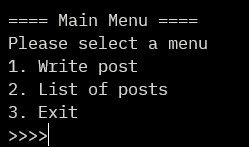

# ベーシック掲示板(Console操作)
**製作目的** : CRUD tutorial  
## **基本設計** : コンソール画面で基本的な掲示板操作
| C            | R                  | U            | D            | その他         |
| ------------ | ------------------ | ------------ | ------------ | -------------- |
| 掲示文を書く | 掲示文リストを確認 | 掲示文を修正 | 掲示文を削除 | 掲示文をロード |
|              | 掲示文の詳細を確認 |              |              | メニューを出力 |
|              |                    |              |              | 掲示文を保存   |
---
## **詳細設計**
### **機能**  
### *Create*
- write_post() : 掲示文を書く
  - Post インスタンスの生成
  - Post list に保存

### *Read*
- list_post() : 掲示文 list
  - Post インスタンスの生成
  - Post list に保存

### *その他*
- 掲示文をロード
  - data.csvファイルにある掲示文データをロードする
    - データ.csvが存在する場合、ロード
        - データ1行ごとに Post インスタンスを作成
        - Post インスタンスを list に保存
    - データ.csvが存在しない場合、ファイルを生成
- メニューを出力
  - 
  - 4、5入力(存在しない項目)入力時、にメニューを再出力
  - 文字入力時に Exception 発生
---
### **Class**  
- Post (掲示文)
  - プロパティ
    - param id : 文番号
    - param title : タイトル
    - param content : 本文
    - param view_count : ビュー(アクセス数)
  - メソッド
      - set_post : プロパティ修正
      - get_{} : プロパティ取得
        - id
        - title
        - content
        - view_count
      - add_view_count : ビューの増加

